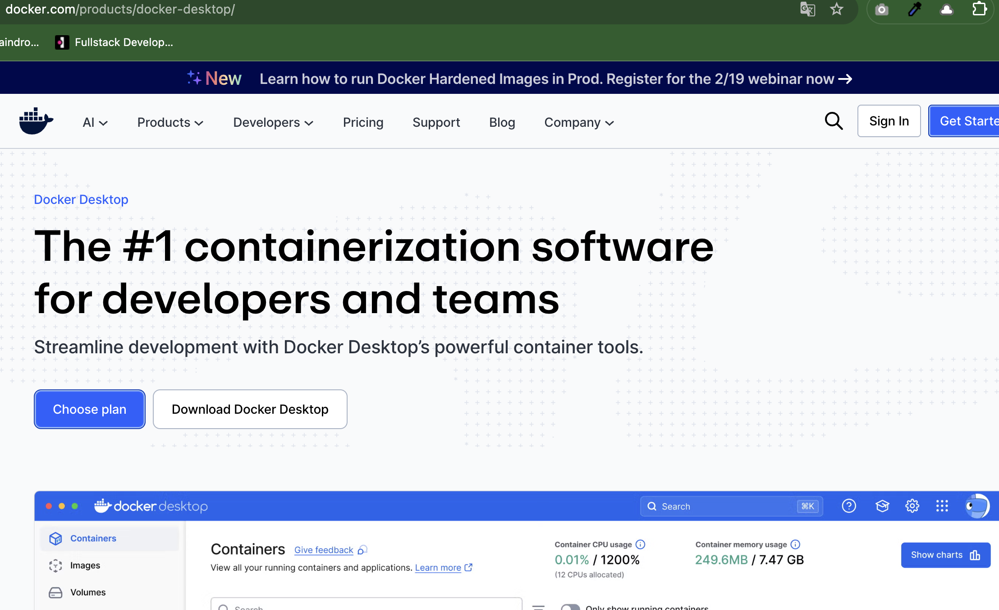
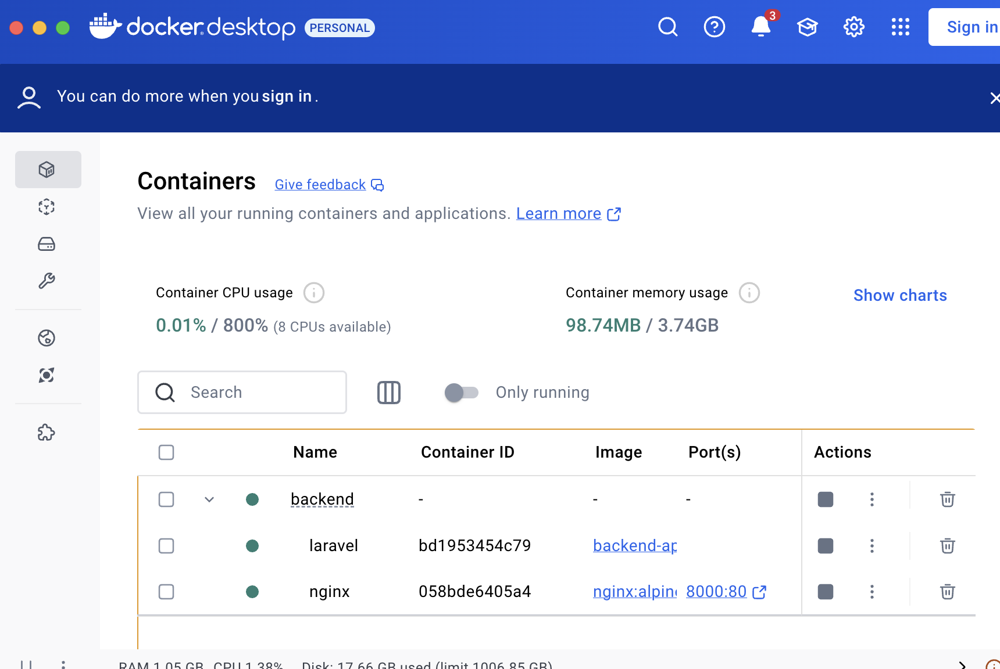
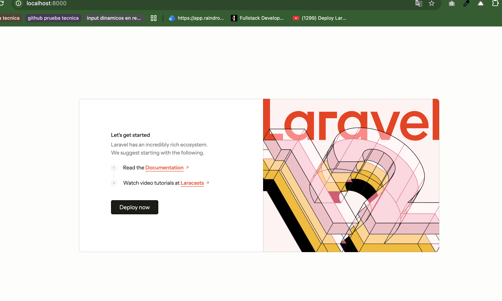

# INSTALL Backend Invoice

Download docker desktop in url

https://www.docker.com/products/docker-desktop/



## Prerequisites
Download and install PHP >= 8.2.30

## Installation Steps

1. Clone the repository:
```bash
git clone https://github.com/go0hum/invoice-back.git
cd "invoice-back"
```

2. Run the development server:
```bash
docker-compose up -d --build
```

3. Install dependencies in the container apache-php:
```bash
docker exec -it laravel bash
composer install
```

You can see the image like:



Later you can see the site in the URL:



http://localhost:8000

The route of the controller is:
